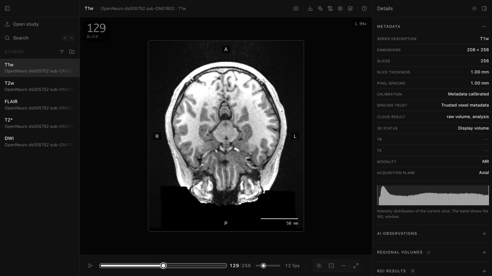

# VoxelLab

[](https://github.com/kaanarici/VoxelLab/actions/workflows/check.yml)
[](LICENSE)

VoxelLab is a local-first desktop and browser viewer for research imaging data.
It opens supported medical volumes and microscopy stacks without requiring an
account or uploading local files.



> [!WARNING]
> VoxelLab is research and educational software. It is not a medical device and
> must not be used for diagnosis, treatment decisions, emergency care, or any
> regulated clinical workflow.

## Download

Download the current builds from [GitHub Releases](https://github.com/kaanarici/VoxelLab/releases/latest).

| Platform | File | Notes |
|---|---|---|
| macOS on Apple Silicon | `VoxelLab.dmg` | The app is not notarized. On first launch, right-click VoxelLab in Applications, choose **Open**, and confirm. |
| Windows | Installer (`.exe`) | The installer is unsigned, so Windows may show a SmartScreen warning. |

The release also contains updater metadata and package files used by the
desktop build. Most users only need the DMG or EXE.

## Open Your First Study

1. Launch VoxelLab and choose **Open study**.
2. Select DICOM files, a NIfTI volume, or a supported microscopy stack. You can
   also drag files or a folder into the window.
3. Use the viewer toolbar to inspect slices, switch views, measure, and export.

Want to start with public data? Run the source version, install the 44 MB lite
demo, and open the generated study:

```bash
npm run demo:install -- --demo lite
npm start
```

The demo is derived from the CC0-licensed
[NIMH Healthy Research Volunteer Dataset](https://openneuro.org/datasets/ds005752).

## What You Can Do

- Inspect supported DICOM and NIfTI volumes in 2D, MPR, 3D, and compare views.
- Explore calibrated OME-TIFF and ImageJ TIFF stacks across channel, Z, and
  time axes, including MPR and 3D for complete regular volumes.
- Measure distances, angles, and regions when spatial calibration is available.
- Plot raw line profiles and run bounded two-channel pixel colocalization.
- Work with overlays, annotations, and a limited set of DICOM derived objects.
- Export supported measurements, images, microscopy evidence, and workflow
  recipes as CSV, JSON, PNG, TIFF, or VoxelLab-authored sidecars.
- Run optional local Python or Modal processing when you configure it.

The interface uses plain HTML, CSS, and JavaScript modules. There is no
frontend build step.

## Supported Data

| Input | Supported workflow | Current limit |
|---|---|---|
| DICOM CT, MR, PT, NM, and OT stacks | 2D viewing, with MPR, 3D, compare, overlays, and measurements when the input supports them | Calibrated volume tools require consistent patient-space geometry and supported scalar pixels. This is not a DICOM conformance product. |
| Enhanced multi-frame CT and MR | Supported frames enter the same stack path as single-frame data | Unsupported transfer syntaxes and irregular or incomplete geometry stay 2D-only or fail closed. |
| NIfTI-1 and NIfTI-2 `.nii` and `.nii.gz` | Local 3D volume import, plus bounded scalar dim-4 data as related independently selectable 3D timepoints with one shared display window and provenance | Supported scalar types include signed 8-bit and unsigned 32-bit data. Paired files, dim-5+, frequency axes, invalid single-file magic or spatial affines, unsafe NIfTI-2 dimensions, and oversized inputs fail closed. Unknown spatial units remain uncalibrated. |
| OME-TIFF and ImageJ TIFF | Scalar stacks, C/Z/T navigation, calibrated MPR/3D, channels, raw line profiles, bounded two-channel colocalization, measurement, and limited ImageJ ROI interchange | Classic stripped 8/16/32-bit signed or unsigned integer and 32-bit float TIFF supports uncompressed, standard LZW, and Deflate storage with Predictor 1 or 2. Interleaved RGB/RGBA can open as channels, and multi-vertex ImageJ PolyLines remain open paths. BigTIFF, tiled pyramids, JPEG compression, planar color, broad ROI Manager parity, and invalid geometry are not supported. ROI ZIP sidecars must be unencrypted stored/deflated entries with valid checksums and within hard resource budgets. |
| TIFF sequences | Homogeneous single-plane images can form an ordered Z stack | Manual XY and Z calibration is required when spacing metadata is absent. |
| OME-Zarr / NGFF | Local import with safe level selection and public URL streaming for OME-NGFF 0.4 and 0.5 multiscales | Zarr v2 supports raw, zlib, gzip, zstd, and the supported Blosc subset with optional byte shuffle. A bounded unsharded Zarr v3 subset supports regular arrays with default chunk keys and bytes plus gzip, zstd, or supported Blosc codecs. Supported scalar types include 8/16/32-bit integers and 32-bit float. CORS is required for URLs. Sharding, bitshuffle, arbitrary filters, unsupported codecs, malformed metadata, oversized chunks, and non-singleton custom axes fail closed. |
| DICOM SEG, RTSTRUCT, RT Dose, and VoxelLab SR | Limited session-backed overlays, ROIs, metadata, and measurement-note re-import | A bounded session queue can hold supported derived objects until the matching source loads. RT Dose is matched-source metadata only: VoxelLab validates its frame of reference, positive dose-grid dimensions, and scaling but never decodes, renders, calculates, or exports a dose grid. Full clinical round-trip is not supported. |

VoxelLab and ImageJ microscopy sidecars are not standalone images. Open them
with their source image or after the matching source series is loaded. Supported
DICOM derived objects may be opened first and will attach when their source
arrives during the same session.

Proprietary microscopy formats such as CZI, ND2, and LIF require configured
local readers or an external OME-TIFF converter. Native local readers can return
each supported scene or position as a separate imported series. The external
converter remains a single-output bridge. OIB, OIF, and LSM require that bridge.
Unsupported converter setups fail closed.

Desktop converter outputs and their provenance are app-managed, session-scoped
temporary artifacts. On a clean exit, and at the next launch after an interrupted
session, terminal conversion artifacts are sent to the operating system trash
rather than permanently deleted. If the platform cannot move an artifact to
trash, VoxelLab leaves it in place and retries stale-session cleanup later.

Unsupported inputs should fail closed instead of appearing as a misleading
volume or calibrated measurement. See [ARCHITECTURE.md](ARCHITECTURE.md) for the
geometry contract and [ACCURACY_LEDGER.md](ACCURACY_LEDGER.md) for the current
synthetic reference checks.

## Local Data and Privacy

Opening local files does not require a VoxelLab account or a hosted backend.
The default browser and desktop import paths process those files locally.

Cloud processing is optional. Files leave your machine only after you
configure Modal and Cloudflare R2 and explicitly start a cloud workflow. Never
put patient data, credentials, or private workspace URLs in an issue, pull
request, screenshot, or committed configuration file.

## Run From Source

Requirements:

- Node.js 22.12.0
- Python 3.11 or newer

```bash
git clone https://github.com/kaanarici/VoxelLab.git
cd VoxelLab
npm run setup
npm start
```

Open <http://localhost:8000>. To run the Electron shell instead, use:

```bash
npm run desktop:start
```

Useful checks:

```bash
npm run check
npm run check:geometry
npm run test:node
npm run test:python
npm run test:browser
```

Optional processing dependencies can be installed separately:

```bash
npm run setup -- --pipeline
npm run setup -- --pipeline --cloud
npm run setup -- --pipeline --rtk
```

Cloud setup is documented in [R2_SETUP.md](R2_SETUP.md).

## Project Status

VoxelLab is an experimental public research tool maintained on a best-effort
basis. Its supported path is local study intake, inspection, measurement, and
export. It is not intended to replace a clinical viewer, PACS, Fiji, or
Bio-Formats.

Bug reports and focused compatibility fixes are welcome. Before reporting a
problem, remove all patient names, identifiers, dates, and private service
details from files, logs, and screenshots.

## Contributing and Support

- Read [CONTRIBUTING.md](CONTRIBUTING.md) before opening a pull request.
- Use [GitHub Issues](https://github.com/kaanarici/VoxelLab/issues) for
  reproducible bugs and focused proposals.
- Report vulnerabilities privately as described in [SECURITY.md](SECURITY.md).
- See [CHANGELOG.md](CHANGELOG.md) for release history.

There is no guaranteed support or response schedule.

## How It Was Built

VoxelLab was created as an experiment in human-directed, AI-generated software.
The implementation was generated with AI coding systems, while the project
owner set the product direction, reviewed the behavior, and decided what to
keep or remove. The practical account, including where the process failed, is
in [BUILDING_WITH_AI.md](BUILDING_WITH_AI.md).

## Credits

VoxelLab uses open-source libraries and public research data from projects
including OpenNeuro, OME, ImageJ, Three.js, dcmjs, and Cornerstone codecs.
Optional processing paths can use SynthSeg, TotalSegmentator, HD-BET, Modal,
and Cloudflare R2. Dataset-specific attribution is recorded in
`demo_packs/catalog.json`.

## License

VoxelLab is available under the [MIT License](LICENSE).
