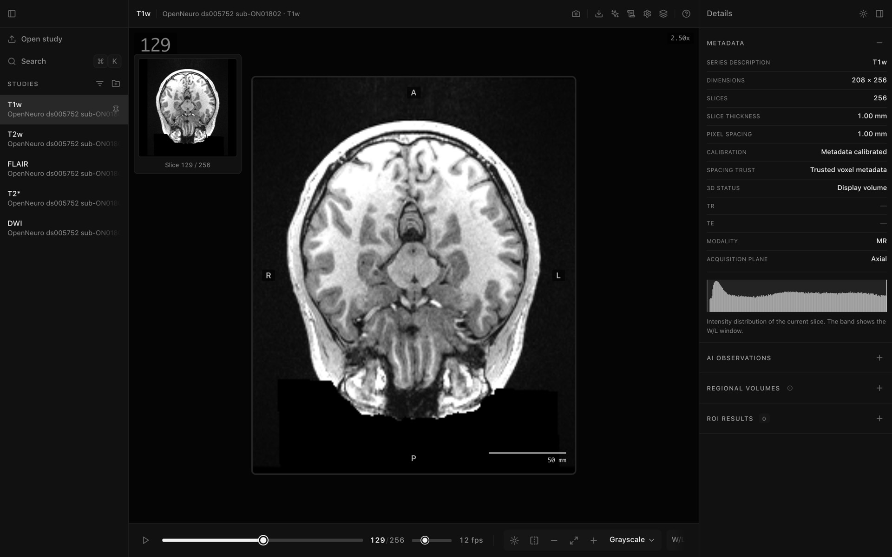

# VoxelLab

[](https://github.com/kaanarici/VoxelLab/actions/workflows/check.yml)

VoxelLab is a local-first desktop and browser viewer for research imaging data.
It opens supported medical volumes and microscopy stacks without an account or
uploading local files.



> [!WARNING]
> VoxelLab is research and educational software. It is not a medical device and
> must not be used for diagnosis, treatment decisions, emergency care, or any
> regulated clinical workflow.

## Download

Download [VoxelLab v1.2.1](https://github.com/kaanarici/VoxelLab/releases/latest).

| Platform | File | First launch |
|---|---|---|
| macOS on Apple Silicon | `VoxelLab-1.2.1-macOS-arm64.dmg` | The app is unsigned and not notarized. Right-click VoxelLab in Applications, select **Open**, then confirm. |
| Windows 10 or 11 on x64 | `VoxelLab-1.2.1-Windows-x64.exe` | The installer is unsigned, so Windows may show a SmartScreen warning. |

Use `SHA256SUMS` from the release to verify either download. Updates are manual:
open **Help → Check for Updates**, download the new installer, and install it
over the current version. VoxelLab does not run an automatic updater.

## Open a Study

1. Launch VoxelLab and select **Open study**.
2. Drop a study folder onto the dialog or select the drop zone. You can also
   drag a folder onto the empty viewer.
3. Use the toolbar to inspect slices, switch views, measure, and export.

To try public data from source, install the 44 MB lite demo:

```bash
npm run demo:install -- --demo lite
npm start
```

The demo is derived from the CC0-licensed
[NIMH Healthy Research Volunteer Dataset](https://openneuro.org/datasets/ds005752).

## Features

- 2D, MPR, 3D, and compare views for supported DICOM and NIfTI volumes.
- Calibrated OME-TIFF, ImageJ TIFF, TIFF sequence, and OME-Zarr workflows.
- Distance, angle, region, line-profile, and two-channel colocalization tools.
- Overlays, annotations, and limited DICOM derived-object support.
- CSV, JSON, PNG, TIFF, DICOM SR, and VoxelLab sidecar exports where supported.
- Optional local Python and explicitly configured cloud processing.

## Supported Data

| Input | Scope |
|---|---|
| DICOM CT, MR, PT, NM, and OT | Scalar stacks; MPR, 3D, compare, overlays, and calibrated measurements require consistent patient-space geometry. This is not a DICOM conformance product. |
| Enhanced multi-frame CT and MR | Supported frames enter the regular DICOM stack path. Unsupported transfer syntaxes, unsafe dimensions, and incomplete or irregular geometry fail closed. |
| NIfTI-1 and NIfTI-2 `.nii` and `.nii.gz` | Single-file 3D volumes and bounded scalar dim-4 timepoints. Paired files, dim-5+, unsafe dimensions, invalid affines, and oversized inputs fail closed. |
| OME-TIFF, ImageJ TIFF, and TIFF sequences | Calibrated scalar stacks, channels, MPR/3D, analysis, measurements, and limited ImageJ ROI interchange. BigTIFF, tiled pyramids, JPEG compression, and broad ROI Manager parity are not supported. |
| OME-Zarr / NGFF 0.4 and 0.5 | Bounded local import and public URL streaming for supported Zarr v2 and unsharded v3 arrays. URLs require CORS; unsupported codecs, filters, sharding, and oversized chunks fail closed. |
| DICOM SEG, RTSTRUCT, RT Dose, and VoxelLab SR | Limited session-backed overlays, ROIs, metadata, and measurement-note import. Dose rendering and full clinical round-trip are not supported. |
| CZI, ND2, LIF, OIB, OIF, and LSM | Require a configured local reader or external OME-TIFF converter. Unsupported setups fail closed. |

VoxelLab enables volumetric and calibrated tools only when the input provides
enough trustworthy geometry. See [Architecture](ARCHITECTURE.md) for the data
contracts and the [Accuracy ledger](ACCURACY_LEDGER.md) for reference checks.

## Privacy

Opening local files does not require a VoxelLab account or a hosted backend.
The default browser and desktop import paths process those files locally.
Files leave your machine only after you configure Modal and Cloudflare R2 and
explicitly start a cloud workflow. Never put patient data, credentials, or
private workspace URLs in an issue, pull request, screenshot, or committed
configuration file.

## Run From Source

Requirements: Node.js 22.12.0 and Python 3.11 or newer. CI and lock files use
Python 3.13.

```bash
git clone https://github.com/kaanarici/VoxelLab.git
cd VoxelLab
npm run setup
npm start
```

Open <http://localhost:8000>. Run `npm run desktop:start` for the Electron app.

Optional dependencies are installed only when requested:

```bash
npm run setup -- --help
npm run setup -- --pipeline
npm run setup -- --ai --provider claude
npm run setup -- --rtk
```

Cloud GPU setup is documented in [R2 setup](R2_SETUP.md). Contributors should
run `npm run check`; see [Contributing](CONTRIBUTING.md) for focused checks and
project rules.

## Project Status

VoxelLab is an experimental, best-effort research tool. It is not a replacement
for a clinical viewer, PACS, Fiji, or Bio-Formats.

- [Report a reproducible bug](https://github.com/kaanarici/VoxelLab/issues)
- [Contribute](CONTRIBUTING.md)
- [Report a vulnerability](SECURITY.md)
- [Read the changelog](CHANGELOG.md)
- [Read how VoxelLab was built](BUILDING_WITH_AI.md)

## Credits

VoxelLab builds on open-source imaging libraries and public research data.
Dataset attribution is recorded in `demo_packs/catalog.json`.

## License

[MIT](LICENSE)
